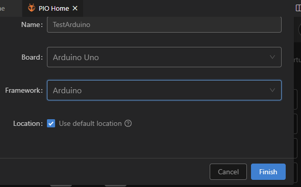
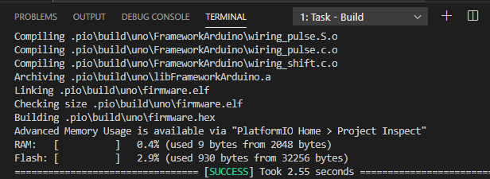

# Module 08 - Plateforme de développement PlatformIO

## Exercice 1 - Installations de la plateforme de développement

### Étape 1 - Installer Visual Studio Code

Si Visual Studio Code est déjà installé, rendez-vous à l'étape 2

- Accédez au site de [VisualStudio Code](https://code.visualstudio.com)

- Découvrez les avantages de cet environnement de développement

- Installez VS Code sur votre PC

### Étape 2 - Installer PlateformIO IDE

[Installation PlatformIO](img/pio_install.png)

1. Ouvrez le gestionnaire d'extension de Visual Studio Code
2. Cherchez "platformio"
3. Intallez PlatformIO IDE

NOTE: pour simplifier, nous abrégeons PlateformIO par *pio*

## Exercice 2 - Développer un programme Arduino dans pio

### Étape 1 - Créer un programme Arduino dans PlateformIO

- Ouvrez PlatformeIO :

  

  1. Cliquez sur l'icône PlatformIO dans la liste des extension (partie gauche de l'écran VSD)

  2. Cliquez sur "Open"

  Ou :

  

  1. Cliquez sur la "maison" présent dans la barre de statut.

- Créez un nouveau projet pio

- Remplissez les cases demandées


- Cliquez sur Finish

La structure suivante a été générée :


- Cliquez sur le chemin *src*. Vous obtenez un fichier *main.cpp* qui englobera le code *arduino*.

- Remplacez tout le code du texte par le code du skecth Blink.ino situé dans l'IDE d'Arduino

<details>
    <summary>Code du sketch "blink" original</summary>

Placez le code suivant dans le fichier "src/main.cpp" :

```cpp
/*
  Blink

  Turns an LED on for one second, then off for one second, repeatedly.

  Most Arduinos have an on-board LED you can control. On the UNO, MEGA and ZERO
  it is attached to digital pin 13, on MKR1000 on pin 6. LED_BUILTIN is set to
  the correct LED pin independent of which board is used.
  If you want to know what pin the on-board LED is connected to on your Arduino
  model, check the Technical Specs of your board at:
  https://www.arduino.cc/en/Main/Products

  modified 8 May 2014
  by Scott Fitzgerald
  modified 2 Sep 2016
  by Arturo Guadalupi
  modified 8 Sep 2016
  by Colby Newman

  This example code is in the public domain.

  http://www.arduino.cc/en/Tutorial/Blink
*/

// the setup function runs once when you press reset or power the board
void setup() {
  // initialize digital pin LED_BUILTIN as an output.
  pinMode(LED_BUILTIN, OUTPUT);
}

// the loop function runs over and over again forever
void loop() {
  digitalWrite(LED_BUILTIN, HIGH);   // turn the LED on (HIGH is the voltage level)
  delay(1000);                       // wait for a second
  digitalWrite(LED_BUILTIN, LOW);    // turn the LED off by making the voltage LOW
  delay(1000);                       // wait for a second
}
```

</details>

### Étape 2 - Compiler un programme Arduino dans pio

- Compilez le code par le bouton *Build*


**LECTURE IMPORTANTE**

Dans la console, vous constaterez des erreurs de compilation. Et c'est normal à cette étape-ci !

Il faut informer *pio* de l'origine des déclarations IMPLICITES comme HIGH, LOW, OUTPUT ou INPUT.

- Ajoutez la directive de précompilation suivante au tout début du code source :

```cpp
#include <Arduino.h>
```

- Compilez le code à nouveau

- Observez la console *pio*. Elle donne un état de cette action.

Le message « SUCCESS » doit apparaître avant de poursuivre!



### Étape 3 - Téléverser le code dans Arduino

- Branchez le câble USB entre la carte et le PC

- Le bouton **Upload** est désigné pour téléverser le code binaire dans l'Arduino

- Vous devriez pouvoir identifier le port série (COMx) associé à l'Arduino

<details>
    <summary>Dépannage</summary>

DANS CERTAINS CAS, *pio* ne détecte pas le pilote du câble USB de téléchargement


1. Assurez-vous que le câble USB est fonctionnel
2. Port non détecté

Parfois, pio ne réussit pas à trouver automatiquement le pilote associé au port de la carte d'Arduino

Il faut alors passer par en mode manuel, de la façon suivante :

1. Dans le menu depio, cliquez sur le chemin platformIO.ini

2. Repérez la structure  "\[env:uno]"

3. Ajouter l'instruction suivante :

```ini
upload_port = com [*noPort*]
```

4. Sauvegardez le fichier plarformIO.ini
5. Tentez le téléchargement à nouveau !

</details>

- Ouvrez un "Terminal" par l'onglet TERMINAL (bas de l'écran)
- Rechercher « platformio device list »

La commande est *platformio device list* abrégée (*pio device list*)
Le téléversement doit avoir réussi

 

- Demandez de l'aide au besoin !

À la fin, la DEL numéro 13 clignote.

Bravo!

Vous avez réussi à interfacer pio avec Arduino !

## Exercice 3 - Développer un programme Arduino dans pio (OPTIONNEL : pratique de création de projet)

### Étape 1 - Feu de circulation

- Créez un nouveau projet *Feu de circulation*
- Importer le programme "420_w48_sf_m02_exercice_feux_circulations.ino" situé dans le module_02 du dépot de source.

- Compilez et téléversez le programme dans Arduino

### Étape 2 - Exécuter un programme avec pio

- Branchez le circuit Feu de circulation sur votre carte Arduino pour terminer la démonstration.

## Exercice 4 - Développer un programme Arduino dans pio (2) (OPTIONNEL : pratique de création de projet)

### Étape 1 - Potentiometre et 2 Dels

- Créez un nouveau projet **PotentiometreBase**

- Adapatez le programme **PotentiometreBase.ino** du "Module 03, Exercice 4, étape 2 : Programmation dans GitHub"

<details>
    <summary>Indice</summary>

 

</details>

Compilez et téléversez le programme dans Arduino

### Étape 2 - Exécuter un programme avec pio 

Branchez le circuit "PotentiometreBase" sur votre carte Arduino pour terminer la démonstration.
