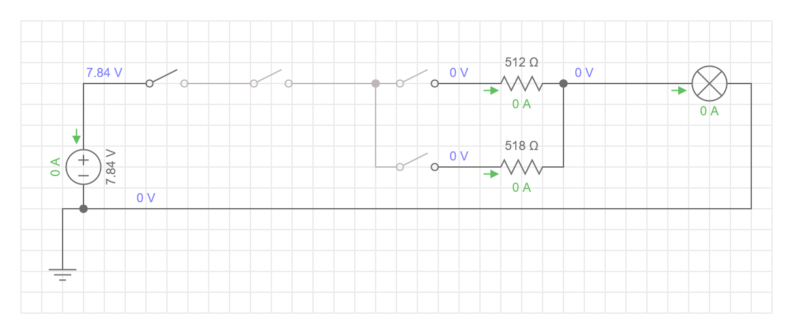
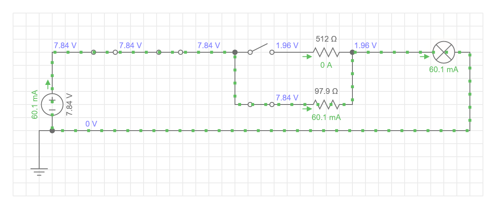

# Module 00 - Mathématiques pour microcontrôleurs 

## Exercice 1 - Conversion de base

- NOTE: pour que l'exercice soit représentatif, utilisez une feuille de papaier et NON un logiciel de  conversion!

### Étape 1 - Conversion de base 10 aux base 2 et 16
- Convertir les nombres suivants de la base 10 vers les bases 2 et 16

- au besoin, combler les chiffres avec des zéro sgnificatifs à gauche

|base 10|   base 2  | base 16 |
|:-----:|-----------|---------|
|7      | 0000 0111 | 0x00 07 |
|123    | xxxx xxxx | 0x00 00 |
|128    | xxxx xxxx | 0x00 00 |
|252    | xxxx xxxx | 0x00 00 |
|255    | xxxx xxxx | 0x00 00 |

|base 10   |       base 2      |    base 16   |
|:-------:|--------------------|--------------|

|292      |xxxx xxxx xxxx xxxx |0x00 00 00 00 |

|2729     |xxxx xxxx xxxx xxxx |0x00 00 00 00 |

### Étape 2 - Conversion de base 2 à base 10

- Convertir les nombres suivants de la base 2 vers la base 10

|   base 2  | base 10|
|:---------:|------|

| 0001 1001 | XXXX |

| 0101 1001 | XXXX |

| 1111 1111 | XXXX |

## Exercice 2 - Pictogrammes de caractères

- Utilisez le fichier ModelisateurPictogramme.pdf et une feuille de papier

### Étape 1 - Calculs d'un pictogramme

- Calculer la représentation des pictogrammes suivants.

### Étape 2 - Représentation d'un pictogramme en mémoire

- Traduire le résultat dans une structure comme celle-ci

    
Structure d'un Pictogramme

byte[] chiffre1 = new byte[] {

    0b0000 0100,
    
    0b0000 1100,
    
     ... }

## Exercice 3 -  Opérateurs de décalage de bits en mémoire

### Étape 1 - Décalage à droite

- Effecuter les opérations suivantes en vous servant du gabarit suivant sur papier

- 80 >>3

- Quelle est la valeur décimale résultante?

- 140 >> 4

- Quelle est la valeur décimale résultante?

- En vous inspirant de ces deux résultats, déterminer une équation équivalente.

### Étape 2 - Décalage à gauche

- Effecuter les opérations suivantes en vous servant du gabarit suivant sur papier

-  43 << 2

- Quelle est la valeur décimale résultante?

-  13 << 3

- Quelle est la valeur décimale résultante?

- 141 << 3

- Quelle est la valeur décimale résultante?

- En vous inspirant de ces résultats, pouvez-vous déterminer une équation équivalente.

### Étape 3 - Compression de données

- Pour comprimer deux chiffres dans un octet, nous effectuons la fonction suivante

Résultat = (premier_chiffre << 4) | deuxiême_chiffre

- Appliquez cette fonction pour compresser les chiffres 5 avec 10

- Quel est l'intervalle de valeurs des variables premier_chiffre et deuxième_chiffre que peut utiliser cette fonction sans erreur?

    
Réponse

   intervalle est [ 0 à  F] 
   
   parce que dans ce mode de compresson, chaque chiffre est limité à 4 bits

## Exercice 3 -  Opérateurs logiques

### Étape 1 - Opérateur OU 

https://everycircuit.com/circuit/4835472285892608

### Étape 2 - Opérateur ET 

https://everycircuit.com/circuit/5763413663547392

### Étape 3 - Operateurs ET avec OU combinés

https://everycircuit.com/circuit/6545510028279808

- Circuit L = a & b & ( c | d )

- fonction L = a & b & c

- fonction L = a & b & d

- fonction L = a & b & ( c| d )

