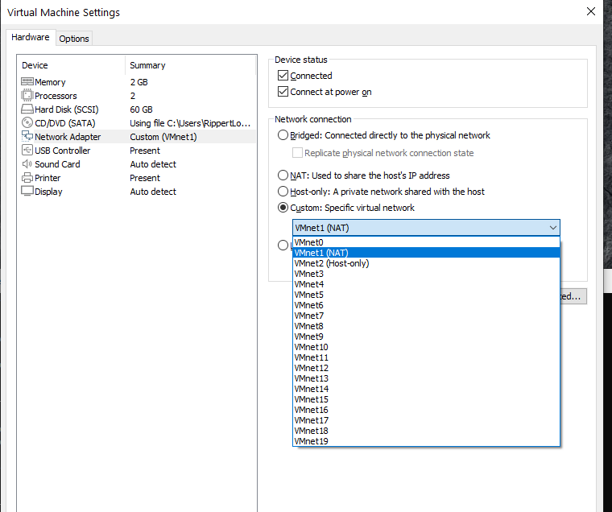

# Mise à niveau 02 - Configuration et Dépannage de Réseaux 

Objectifs:

- Distinguer adresse IP locale et adresse IP publique
- Déterminer l'adresse IP de périphériques sur le réseau local ou sur le réseau publique
- Configurer une VM sur un réseau en mode Bridged et NAT

***NOTE: afin de simplifier la lecture, l'expression PC désigne soit votre PC de table ou votre PC portable.***

## Exercice 1 - Déterminer l'adresse IP du poste sur le réseau local

- Utilisez une commande appropriée pour déterminer les valeurs suivantes de votre carte Ethernet (filée (RJ-45) ou sans-fil) :
  - Adresse IP du poste = ??????
  - Masque de sous-réseau = ?????
  - Adresse IP de la passerelle par défaut = ?????
  - Adresse IP  du serveur DHCP (si connu) = ?????
  - Adresse IP  du serveur DNS de premier niveau (si connu) = ?????

## Exercice 2 - Déterminer l'adresse IP publique du poste

- Utilisez une commande appropriée pour déterminer l'adresse IP publique de votre poste sur Internet.
  - Adresse IP publique du poste = ??????

## Exercice 3 - Configuration de réseaux pour une VM

Les images présentées dans cet exercice utilisent le logiciel ```VMware Workstation```. L'usage du logiciel ```Oracle VM Virtualbox``` est possible; les images sont différentes mais les fonctions semblables.

### Exercice 3.1 - Configuration des modes Bridged et NAT

- Sur le PC hôte, démarrez le logiciel ```VMware Workstation```. Configurez 2 modes de connexion Réseau : ```Bridged``` et ```NAT```. 

<details>
    <summary>Configuration des réseaux </summary>


</details>

Pour le mode "Bridged", choisir la carte Ethernet de votre PC. Ne PAS utiliser la valeur AUTOMATIQUE. 

- Pour Le mode NAT,  configurez le réseau ```192.168.202.0```. Activez le protocole DHCP pour propager des adresses dans l'intervalle ```50 à 254```.

### Exercice 3.2 - Connexion de la VM en mode NAT

- Démarrez votre VM  dans VMworkstation.
- Configurez la carte virtuelle de votre VM en mode NAT, en 2 étapes.

<details>
    <summary>Configuration des réseaux sur la VM</summary>



</details>

- Sur votre VM, utilisez une commande appropriée pour déterminer l'adresse IP reçu par le protocole DHCP. Une valeur correspondante dans le réseau 192.168.202.0 devrait apparaître. Sinon, reprendre cet exercice au début.

### Exercice 3.3 - Connexion de la VM en mode Bridged

- Configurez la carte virtuelle de votre VM en mode Bridged. Utilisez les images précédentes pour vous aider.
- Sur votre VM, Utilisez une commande appropriée pour déterminer son adresse IP.
- L'adresse IP de la VM devrait être sur le même réseau que le PC hôte. Comment procéder pour démontrer cela ?

## Exercice 4 - Rejoindre un périphérique sans-fil sur le réseau local (optionnel)

### Exercice 4.1 - Rejoindre une tablette ou un cellulaire

- Déterminez l'adresse IP locale de votre tablette ou cellulaire.
- Adresse IP locale du périphérique = ??????
- Utilisez une commande du PC pour rejoindre cet appareil. Passez en mode Avion. Le PC peut-il servir à déterminer la présence de l'appareil ?
- Comment pouvez-vous affirmer que le périphérique est sur le même réseau que votre PC ?

### Exercice 4.2 - Rejoindre un site Internet sur une tablette ou un cellulaire

- Installez le logiciel ```network ping lite``` sur votre tablette ou votre cellulaire
- Utilisez la fonction  ```ping``` du logiciel pour tracer la route jusqu'à google.com. Combien de sauts a-t-il fallut ?
- Quelle est l'adresse IP publique de ce site de Google ?
- Utilisez la fonction  ```Port scanning``` du logiciel pour déterminer les ports TCP écoutés par google.com
