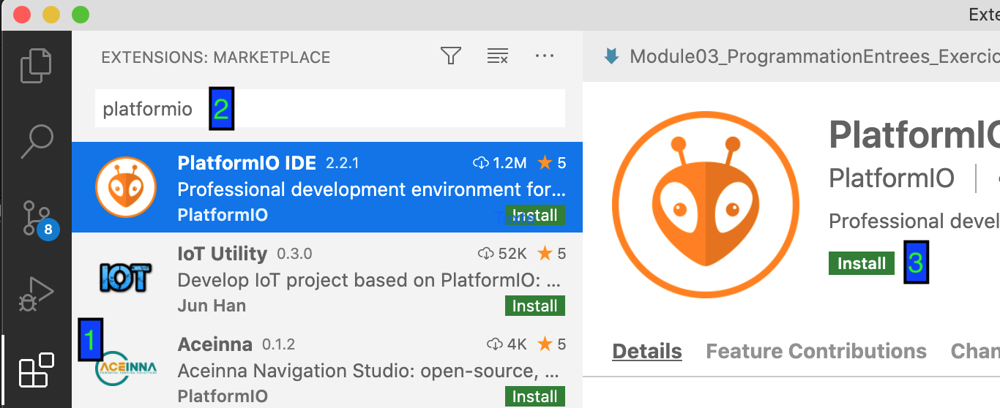
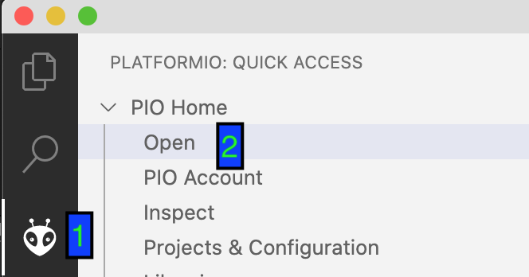
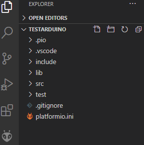
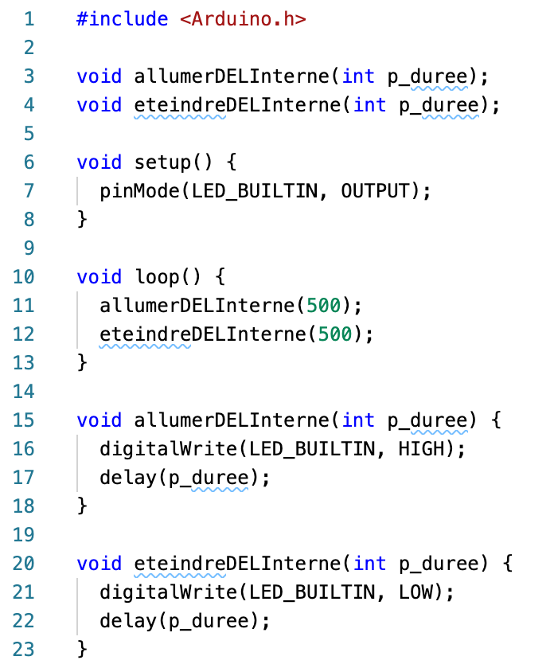

# Module 01 - Introduction

---
Avant chaque manipulation de votre Arduino, touchez une pièce de métal avec votre doigt **MAIS SURTOUT PAS LE MÉTAL** de la carte.

Pour chaque montage électronique, **TOUJOURS** placer **UNIQUEMENT** la carte Arduino et les pièces nécessaires à un montage. Disposez les pièces de façon à les aligner et bien les identifier avant un montage.

Ces précautions protégeront vos montages, faciliteront vos vérifications en cas d’erreur et un service plus rapide des animateurs pour vous dépanner au besoin.

---

Les objectifs des activités suivantes sont :

- Installer les outils nécessaire à la programmation de votre carte arduino sur votre poste de travail
- Valider que le programme fonctionne
- Valider que le programme peut communiquer avec la carte arduino
- Avoir une première approche des langages C/C++
- Découvrir quelques fonctionnalités de la carte arduino et des bibliothèques de base

## Préalable - Installations de la plateforme de développement

### Étape 1 - Installer Visual Studio Code

Si Visual Studio Code est déjà installé, rendez-vous à l'étape 2

- Accédez au site de [VisualStudio Code](https://code.visualstudio.com)

- Découvrez les avantages de cet environnement de développement

- Installez VS Code sur votre PC

### Étape 2 - Installer PlateformIO IDE



1. Ouvrez le gestionnaire d'extension de Visual Studio Code
2. Cherchez "platformio"
3. Intallez PlatformIO IDE

NOTE: pour simplifier, nous abrégeons PlateformIO par *pio*

## Exercice 1 - Développer un programme Arduino dans PIO

### Étape 1 - Créer un programme Arduino dans PlateformIO

- Ouvrez PlatformeIO :

  

  1. Cliquez sur l'icône PlatformIO dans la liste des extension (partie gauche de l'écran VSD)

  2. Cliquez sur "Open"

  Ou :

  

  1. Cliquez sur la "maison" présent dans la barre de statut.

- Créez un nouveau projet pio

- Remplissez les cases demandées


- Cliquez sur Finish

La structure suivante a été générée :



- Cliquez sur le chemin *src*. Vous obtenez un fichier *main.cpp* qui englobera le code *arduino*.

- Remplacez tout le code par :



### Étape 2 - Compiler un programme Arduino dans pio

- Compilez le code par le bouton *Build*


- Dans la console, vous constaterez peut-être des erreurs de compilation. Et c'est normal à cette étape-ci ! Corrigez vos erreurs et Compilez le code à nouveau
- Observez la console *pio*. Elle donne un état de cette action.

Le message « SUCCESS » doit apparaître avant de poursuivre!


### Étape 3 - Téléverser le code dans Arduino

- Branchez le câble USB entre la carte et le PC

- Le bouton **Upload** est désigné pour téléverser le code binaire dans l'Arduino

- Vous devriez pouvoir identifier le port série (COMx) associé à l'Arduino

<details>
    <summary>Dépannage 01</summary>

DANS CERTAINS CAS, *pio* ne détecte pas le pilote du câble USB de téléchargement


1. Assurez-vous que le câble USB est fonctionnel
2. Port non détecté

Parfois, pio ne réussit pas à trouver automatiquement le pilote associé au port de la carte d'Arduino. Il faut alors passer par en mode manuel, de la façon suivante :

- Ouvrez un "Terminal" par l'onglet TERMINAL (bas de l'écran)
- Tapez la commande ```pio device list```

 

1. De retour dans Visual Studio Code, dans le menu des fichiers du projet, cliquez sur le fichier "platformIO.ini"
2. Repérez la structure  "\[env:uno]"
3. Ajouter l'instruction suivante :

```ini
upload_port = com [*noPort*]
```

4. Sauvegardez le fichier plarformIO.ini
5. Tentez le téléchargement à nouveau !  
  
Le téléversement doit avoir réussi !
  
</details>

<details>
    <summary>Dépannage 02 - Si le syndrome persiste ou que le port n'est pas détecté !</summary>
  
Allez à l'adresse suivante : [https://learn.sparkfun.com/tutorials/how-to-install-ch340-drivers/all](https://learn.sparkfun.com/tutorials/how-to-install-ch340-drivers/all) et suivez les instructions d'installation et recommencez le téléversement.
  
</details>

- Demandez de l'aide au besoin !

À la fin, la DEL numéro 13 clignote.

Bravo!

Vous avez réussi à interfacer pio avec Arduino !

## Exercice 2 - Variation de motifs

Faites différentes version de votre programme pour que :

- La del s'allume 1 seconde et s'éteigne 0.5 seconde
- La del s'allume 0,5 seconde et s'éteigne 1 seconde, s'allume 1 seconde et s'éteigne 0,5s.

## Exercice 3 - Persistance rétinienne

Créez un nouveau programme qui allume et éteigne la del à une fréquence suffisante pour que vos yeux ne constatent pas les changements d'états à cause de l'effet de la  ```persistance rétinienne ```. Notez cette valeur.

## Exercice 4 - SOS en morse

Créez un nouveau programme qui se sert de la DEL afin d'afficher la séquence  ```SOS ``` qui, en morse, se traduit par   ```... --- ...```". Un ```tiret -```, appelé  ```long``` correspond à la durée de 3 ```points .``` appelé  ```court```. Le changement de lettre (ici, représenté par un espace ("  ") correspond à un temps équivalent à 3 ```court```. Considérez une durée de *0,2 seconde* équivalente à un ```court```.

## Exercice 5 - D’où viennent les valeurs LED_BUILTIN, HIGH, LOW, etc.

À partir de votre fichier "main.cpp", faites un clic droit sur la consigne "#include <Arduino.h>" et choisissez "Go to definition".

**!!!EXPLOREZ sans sauvegarder!!!**

- Observez le contenu du fichier **sans le modifier**.
- Notez les valeurs des constantes suivantes :
  - HIGH
  - LOW
- Retournez dans votre fichier "main.cpp", placez vous sur la constante LED_BUILTIN et faites un "Go to definition" et notez la valeur.
- Lisez la déclaration de la macro  ```sqr```, notez ses paramètres et son algorithme.

Les programmes en C/C++ compilés avec PlatformIO demandent d'inclure l'instruction ```#include <Arduino.h>```. Cette consigne informe le compilateur que des informations incluses dans le fichier <Arduino.h> sont nécessaires au programme. C'est le cas pour les constantes HIGH, LOW et bien d'autres.

Les fichiers, comme <Arduino.h>, portent le nom de fichier d'entête (HEADER FILE).  Les mots comme HIGH s'appellent  constantes implicites. Elles sont représentées en majuscules pour en faciliter le repérage dans le code.

La compilation de votre programme C/C++ passe par une phase préalable appelée précompilation.

Une des actions de la précompilation est de rechercher les mots  dans le code source et le remplacer par la valeur trouvée dans le fichier d'entête (HIGH devient 1).


