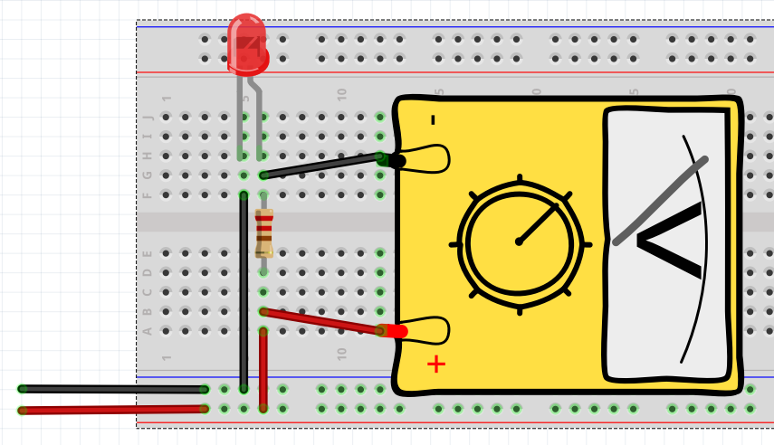
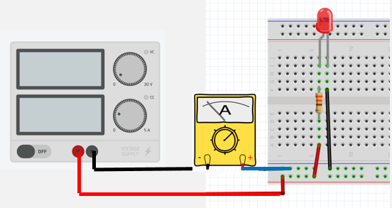

# Module 03 - Notions d'Électricité

Objectif

- Assembler des circuits sur une platine "Breadbord"
- Mesurer les valeurs de résistance, de courant et de tension à l'aide du multimètre

## Exercice 1 - Assemblage d'un circuit

### Matériel

- Bloc d'alimentation variable et ses accessoires
- 1 multimètre et ses accessoires
- 1 carré de mousse
- 1 mini breadbord
- Ensemble de câbles connecteurs de couleur et longueur variées
- 2 résistances de 680 &#8486;
- 1 DEL de couleur rouge
- 1 DEL de couleur verte

### Étape 1 - Calibration du bloc d'alimentation

- Rassemblez les pièces et fixez-les sur un carré de mousse
- Branchez les connecteurs "alligator" rouge et noir dans les fiches du bloc d'alimentation
- Tournez le bouton de tension au minimum
- Tournez le bouton de courant au minimum
- Branchez le bloc d'alimentation dans une prise du secteur
- Tournez le bouton de tension jusqu'à une valeur de 5 Volt
- Courcircuitez les deux connecteurs, puis tournez le bouton du courant jusqu'à une valeur de 0,5 A (500 mA). NE PAS DÉPASSER
- Fermez le bloc d'alimentation
- Débranchez les deux connecteurs

### Étape 2 - Circuit avec une DEL 

Dans cette étape, vous allez construire un circuit pour allumenter une DEL et mesurer le courant qui circule dans le circuit

- Branchez 2 connecteurs à prise alligatore sur le bloc d'alimentation

- Construire le circuit d'alimentation de la DEL en série avec une résistance de 680 &#8486; sur la Breadboard

### Étape 3 - Mesure de la tension 

- Branchez le multimètre en mode Voltmètre entre les 2 bornes de la résistance (vous devez le positionner sur le symbole V-CC et non v-AC); utilisez deux connecteurs de type crochets.
Branchement du VoltMètre

- Alimentez le circuit; la DEL doit allumée, sinon dépannez
- Notez la valeur de la tension dans votre cahier de laboratoire
- Fermez l'alimentation
- Débranchez le voltmètre
- Calculez le courant avec la loi d'Ohm. 

### Étape 4 - Mesure du courant 
 
- Configurez le multimètre en mode ampèremètre. 
La vidéo https://youtu.be/nh9mXn2TT9U doit avoir été visionnée auparavant

- Branchez-le en série avec la borne négative du bloc d'alimentation 

    
Mesure du courant

- Alimentez le circuit
- Notez la valeur du courant total dans votre cahier de laboratoire
- Fermez l'alimentation

### Étape 5 - Calculs et conclusion

- Les calculs de la d'Ohm correspondent-ils aux mesures? Expliquez
 
## Exercice 2 - Assemblage d'un circuit à deux DELs 

### Étape 1 - Circuit avec 2 DELs

- Ajoutez un autre circuit composée de la  DEL verte et d'une résistance de 680 &#8486; 

    
schéma du circuit

- Testez le circuit; les deux DELs doivent s'allumer

### Étape 2 - Mesure du courant

- Notez la valeur du courant total dans votre cahier de laboratoire
- Mesurez le courant du circuit de la DEL verte seule.
- Notez la valeur du courant dans votre cahier de laboratoire

- Comparez la valeur du courant total avec les valeurs du courant du circuit des DELs rouge et verte. Quelle conclusion pouvez-vous tirer?
