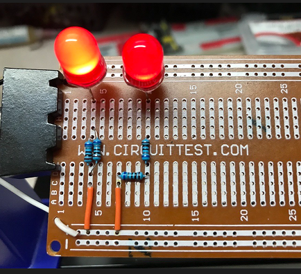
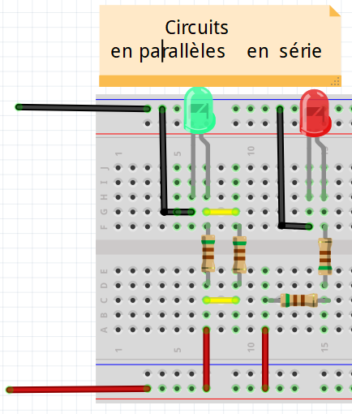

# Module 03 - Notions d'Électricité

Objectifs

- Assembler des circuits de résistances en série, en parallèle ou en circuit combiné
- Mesurer les valeurs de résistance
- Comparer les valeurs mesurées aux valeurs calculées

    
Montage sur platine soudée

               Le montage en série est marqué "S".

## Matériel

- Bloc d'alimentation variable et ses accessoires
- 1 multimètre et ses accessoires
- 1 carré de mousse
- 1 mini breadbord
- Ensemble de câbles connecteurs de couleur et longueur variées
- 4 résistances de 510 &#8486;
- 2 DELs de couleur rouge

## Calibration du bloc d'alimentation

- Rassemblez les pièces et fixez-les sur un carré de mousse
- Branchez les connecteurs "alligator" rouge et noir dans les fiches du bloc d'alimentation
- Tournez le bouton de tension au minimum
- Tournez le bouton de courant au minimum
- Branchez le bloc d'alimentation dans une prise du secteur
- Tournez le bouton de tension jusqu'à une valeur de 5 Volt
- Courcircuitez les deux connecteurs, puis tournez le bouton du courant jusqu'à une valeur de 0,5 A (500 mA). NE PAS DÉPASSER
- Fermez le bloc d'alimentation
- Débranchez les deux connecteurs

    
schéma complet du montage

               Le montage en série est marqué "S"
               Le montage en parallèle est marqué "//"

## Exercice 1 - Circuit de résistances en série

### Étape 1 -  Assemblage du circuit

Dans cette étape, vous allez construire un circuit avec 2 résistances en série pour alimenter une DEL

- Sur la Breadboard, construire le circuit de 2 résistances de 510 &#8486; branchées en série.
- Ajoutez une DEL rouge.

### Étape 2 - Mesure de la résistance
 
- Avec l'Ohmmètre, mesurez la valeur de la résistance totale des 2 résistances ensemble. Notez cette valeur dans votre cahier de laboratoire.

- Calculez la valeur de la résistance équivalente. Obtenez-vous le même résultat?

### Étape 3 - Mesure du courant
 
- Configurez votre multimètre en mode ampèremètre.
- Complétez le circuit pour alimenter la DEL. Branchez l'ampèremètre.
- Alimentez le circuit. Notez cette valeur dans votre cahier de laboratoirece.

## Exercice 2 - Circuit de résistances en parallèle

### Étape 1 -  Assemblage du circuit 

Dans cette étape, vous allez construire un circuit avec 2 résistances en parallèle.

- Sur la Breadboard, construire le circuit de 2 résistances de 510 &#8486; branchées en parallèle.
- Ajoutez une DEL rouge.

### Étape 2 - Mesure de la résistance
 
- Avec l'Ohmmètre, mesurez la valeur de la résistance totale des 2 résistances ensemble. Notez cette valeur dans votre cahier de laboratoire.

- Calculez la valeur de la résistance équivalente. Obtenez-vous le même résultat?

### Étape 3 - Mesure du courant
 
- Pour mesurer le courant du circuit en parallèle, vous devez débrancher une partie du circuit en en série. Quel fil devez-vous débrancher? Notez cette réponse dans votre cahier de laboratoire.

- Alimentez le circuit. Notez cette valeur dans votre cahier de laboratoire.
 
### Étape 4 - Discussion

- Rebranchez le fil débranché dans l'étape précédente en série.

- Mesurez le courant total des deux circuits. Notez cette valeur dans votre cahier de laboratoire.

- Comment expliquez-vous que l'éclairage des 2 DELs soient si différentes? Discutez-en en équipe.