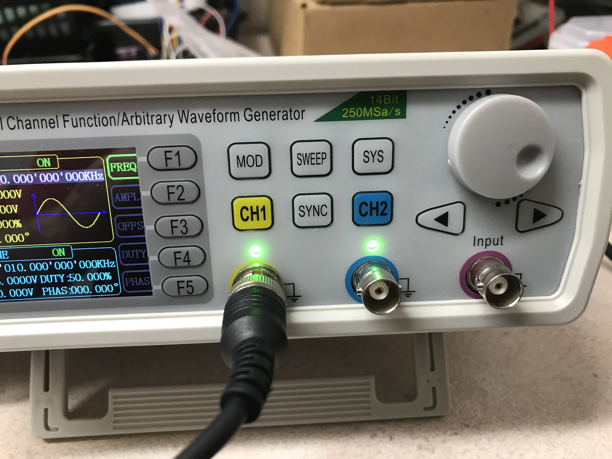
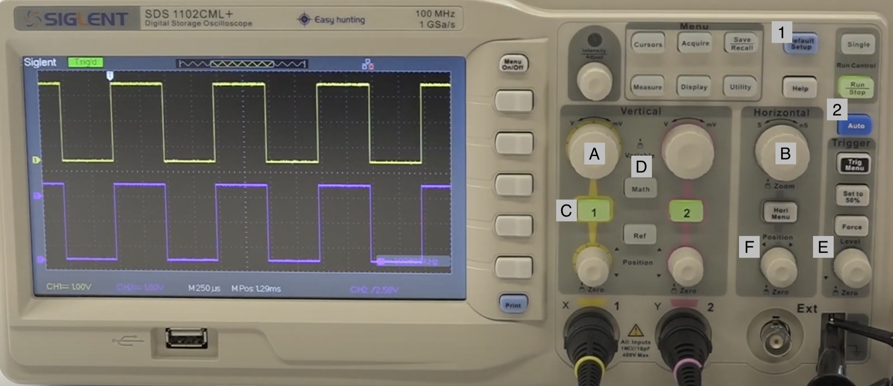
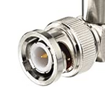
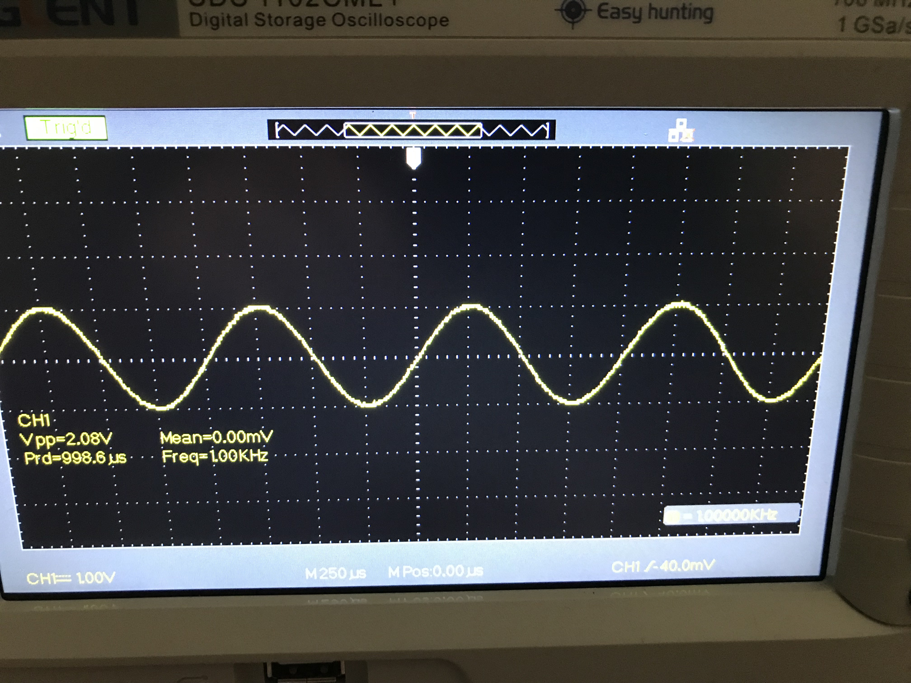
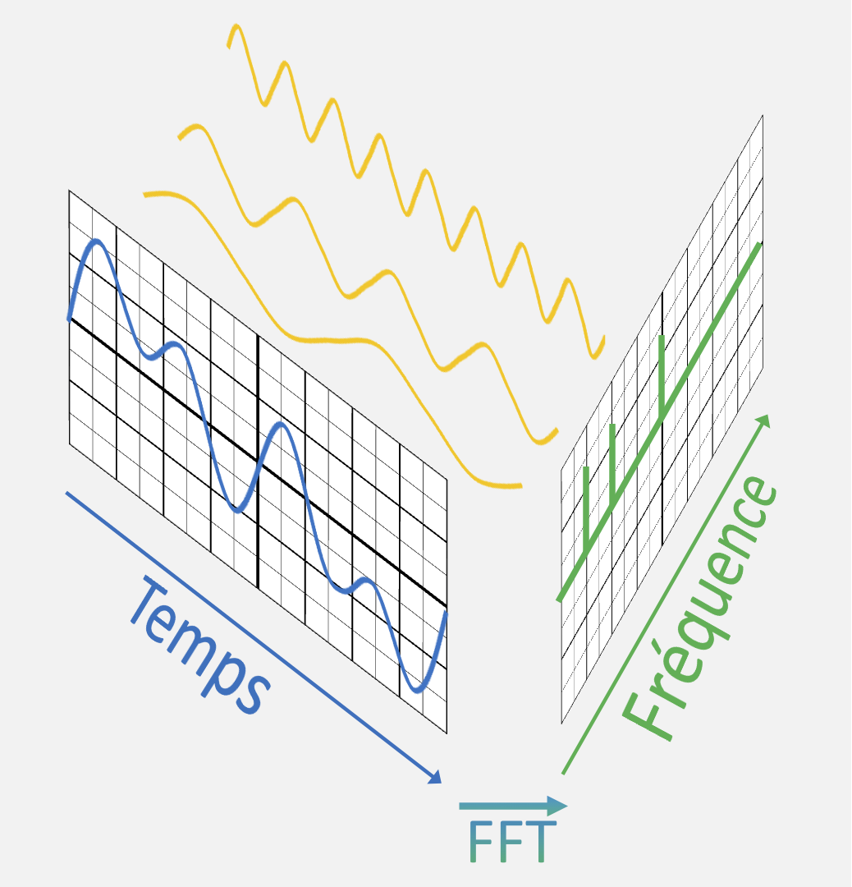

# Module 03 - Notions d'Électricité - Laboratoire #3 - Introduction à l'oscilloscope

Objectifs :

- Manipuler le générateur de basses fréquences
- Contrôler les ondes émises, en forme, fréquence et amplitude
- Mesurer différents rapports cycliques d'une onde carrée

## Matériel

- Générateur de basses fréquences Modèle FeelTech FY6600 et ses accessoires
- Oscilloscope Modèle Siglent et ses accessoires

    
Générateur de basses fréquences

    
Oscilloscope

## Exercice 1 - Générateur de basses fréquences (GbF)

### Étape 1 - Valeurs par défaut  

- Allumez le GbF.
- Notez les valeurs par défaut:
  - Forme de l'onde
  - Fréquence
  - Tension maximale
  - Rapport cyclique

Dans ce laboratoire, nous explorerons ces quatre fonctions en usage sur le canal CH1. De nombreuses autres activités sont possibles, mais sont remises à plus tard.

Pour faciliter les observations, vous allez "camoufler" le canal CH2. Procédez comme suit

- Appuyez sur **_CH2_**. Le canal CH2 bascule au niveau de sa configuraton. Cliquez à nouveau sur CH2; le témoin lumineux s'éteind; de cette façon, la borne n'envoie aucun signal de sortie.
- Appuyez sur **_WAVE_**. Tournez 3 fois la molette. Le format **_DC_** s'affiche. Une ligne droite parcoure l'axe horizontal.

En tout temps, fermez l'appareil pour obtenir la configuration de base du GbF.

### Étape 2 -  Configuration d'ondes

Dans cette étape, vous utiliserez les boutons WAVE, F1, F2 et F4 pour obtenir une onde sinusoidale, de 1 000 Hz (1 KHz), avec une tension maximale de 2 Volt.

- Appuyez sur **_CH1_**. Le canal CH1 bascule au niveau de sa configuraton.
- Changez la fréquence pour 1 000 Hz en appuyant sur F1. Appuyez 4 fois au centre de la molette pour faire passer successivement l'unité de fréquence de Khz à Hz. Utilisez les boutons **_>_** et **_<_** pour changer le chiffre de l'unité de mesure.
- Diminuez la tension de l'onde pour une valeur de 2 Volt.  

### Étape 3 -  Usage de l'oscilloscope

Vous utiliserez l'oscilloscope pour mesurer les valeurs de tensions et de période d'une onde produite par le GbF.

- Branchez l'oscilloscope dans le secteur.
- Branchez un câble BNC mâle-mâle  entre la sortie **_CH1_** du GbF et l'entrée jaune de l'oscilloscope. C'est un accessoire du GbF.

#### Fins ajustements

- Sur l'oscilloscope, appuyez sur les boutons bleus "Default Setup" (1) et "Auto" (2). Une onde sinusoïdale stable doit apparaître sur le moniteur.
- Tournez la molette supérieure du balayage horizontal (B) pour obtenir 4 cycles d'onde à l'écran. L'indicateur doit donner la valeur **_MPos_** seconde, sinon tournez la molette inférieure.
- Tournez la minimolette verticale du canal jaune (A). Un menu temporaire apparaît à l'écran. La valeur  **_Volts Pos=0,00mV_** donne la bonne position.
- Tournez la molette verticale supérieure du canal jaune (A) pour obtenir une graduation de 1,00 V par carreau.

Avec ces ajustements, un cycle de l'onde débute aux croissement des axes X et Y et se termine 4 carreaux plus loin. L'indicateur "T" (trigger) est positionné sur l'axe Y. L'indicateur jaune "1" est positionné sur l'axe "X".

    
Onde sinusoïdale

- Répondez aux questions suivantes:
  - Quelle est l'unité de temps représentant un carreau ?
  - Combien de temps dure un cycle complet?
  - Quelle est la valeur de la tension après 500 **_u_** secondes?

## Exercice 2 - Rapport cyclique

Le rapport cyclique joue un rôle important dans le contrôle des périphériques. Plus le rapport cyclique est faible, moins de courant circule dans les équipements. C'est ainsi qu'on contrôle la vitesse de moteurs, l'éclairage de DELs, etc.

Sur l'image suivante, le rapport de cycle est t1 / T :

### Étape 1 - Rapport cyclique

- Modifiez le type d'ondes du GbF pour produire la forme "CMOS".
- Modifiez le rapport cyclique (DUTY) pour une valeur de 25 %.
- Rafraîchissez l'écran de l'oscilloscope; appuyez sur les boutons bleus "Default Setup" (1) et  "Auto" (2).
- Dessinez les formes d'ondes observées dans votre cahier de laboratoire en notant le rapport de cycle

    
Example de rapport cyclique de 25 %

  
- Répondez aux questions suivantes:
  - Pendant combien de temps, la sortie du Gbf est-elle à 2 V?
  - Pendant combien de temps, la sortie du Gbf est-elle à 0 V?
  - Combien de temps dure un cycle complet?
  - Vérifier que le rapport de cycle est correct.

### Étape 2 - Autres rapports cycliques

- Ajustez l'appareil pour obtenir un rapport cyclique à 75 %
- Ajuster l'appareil pour obtenir un rapport cyclique à 90 %
- Dessinez les formes d'ondes observées dans votre cahier de laboratoire en notant le rapport de cycle

## Exercice 3 - Une autre façon de voir la/les fréquences s'un signal

### Transformée de Fourier

La transformée de Fourier (FT) permet de calculer le spectre d'un signal : on passe d'un mode temporel à un mode fréquentiel. La FT est utilisée dans votre vie de tous les jours : compression d'images et de vidéos, égaliseur, filtrage de sons parasites, etc.

Sur l'image précédente, on voit un signal complexe qui est décomposé ici en 3 sinusoïdes de fréquences différentes par la transformée de Fourier.

L'amplitude d'une fréquence correspond à son amplitude avec sa présence dans le signal temporel.

Votre oscilloscope est capable d'appliquer des fonctions mathématiques sur un signal d'entrée. Une de ces fonctions est la FFT (Fast Fourier Transformation) qui est une approximation de la FT.

### Étape 1 - Observation d'un signal sinusoïdale

- Positionnez-vous sur le réglage de la sortie 1
- Réglez la forme d'onde du GbF sur "SIN"
- Choisissez une fréquence de 10 KHz
- Connectez la sortie 1 sur la voie 1 de l'oscilloscope
- Réglez l'échelle horizontale (B) afin d'avoir beaucoup de périodes de signal (environ 8 à 10 cycles). Si l'affichage n'est pas stable, pensez à utiliser les boutons de réglage du déclencheur (E)
- Appuyez sur le bouton "Math" (D)
- Choisissez l'opération FFT et appliquez l'opération sur la source (voie) 1
- Choisissez le mode de fenêtre "Rectangle"
- Dans ce mode, vous pouvez utiliser les molettes d'échelles horizontale et verticale afin d'améliorer l'affichage de votre FFT et surtout zoomer dessus.
- Avec la molette "Position" (F), vous pouvez déplacer la valeur du centre de l'affichage et valider la fréquence à l'aide du pic. Si le pic n'est pas valide à la fréquence du GbF, jouez avec les paramètres des échelles.
- Dessinez la forme du signal d'entré ainsi que sa FFT dans votre cahier de laboratoire.

**Pour passer des réglages du signal à ceux de la FFT, appuyez sur le bouton de la voie 1 pour paramétrer le signal et appuyez sur le bouton Math pour paramétrer l'affichage de la FFT**

### Étape 2 - Observation d'un mélange signaux sinusoïdaux

- Positionnez-vous sur le réglage de la sortie 1
- Réglez la forme d'onde du GbF sur "ARB1"
- Gardez une fréquence de 10 KHz
- Réglez l'échelle horizontale afin d'avoir beaucoup de période de signal.
- Affichez la FFT de la voie 1. Ajustez les paramètres d'affichage afin de pouvoir observer les fréquences du signal.
- Dessinez la forme du signal d'entré ainsi que sa FFT dans votre cahier de laboratoire.
- Notez le nombre de fréquences visibles du signal
- Positionnez-vous sur le réglage de la sortie 1
- Réglez la forme d'onde du GbF sur "ARB2"
- Effectuez les mêmes actions que précédemment

### Étape 3 - Observation d'un signal carré

- Refaite les manipulations précédentes mais cette fois-ci en modifiant la forme d'onde pour le type CMOS.
- Qu'observez-vous ?
- Dessinez la forme du signal d'entré ainsi que sa FFT dans votre cahier de laboratoire.

    
À lire une fois l'observation faite

Sur la FFT, vous devriez voir plusieurs pics. Celui qui a le plus d'amplitude correspond à la fréquence fondamentale et doit correspondre à la fréquence que vous avez choisi sur le GbF. Les autres pics sont d'amplitude plus faible et correspondent aux harmoniques. Une harmonique est une fréquence qui est multiple de la fréquence fondamentale. 

Les harmoniques sont intéressantes en musique, elles donnent un son différent à un La de (440Hz) pour un piano ou une guitare.

Les harmoniques peuvent aussi poser des problèmes comme dans le cas d'une transmission radio.

