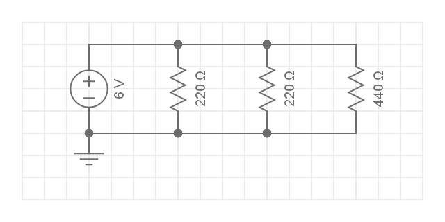
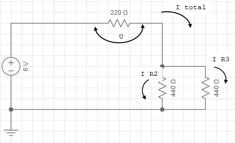

# Module 03 - Notions d'Électricité

Dans ce module vous allez calculer les valeurs d'intensité, tension et résistances dans certains montages.

## Exercice 1 - Résistances en série

### Étape 1 - 2 Résistances en série


À l'aide de l'illustration

- Effectuez le calcul de R<sub> T</sub>, la résistance équivalente

- Calculez le courant I<sub> T</sub> qui circule dans le circuit

- Calculez la tension aux bornes de chaque résistance

<details>
    <summary>Solution</summary>

R<sub> T</sub> = 220 &#8486; + 220 &#8486; = 440 &#8486;  
I<sub> T</sub> = 6 V / 440 &#8486; = 13,6 mA

U1 = 220 mA * 13,43 &#8486; = 3 V  
U2 = 220 mA * 13,43 &#8486; = 3 V  

**Simulation** sur : https://everycircuit.com/embed/6709376909574144

</details>

### Étape 2 - 3 Résistances en série


À l'aide de l'illustration

- Effectuez le calcul de R<sub> T</sub>
- Calculez le courant I<sub> T</sub> qui circulera dans le circuit
- Calculez la tension aux bornes de chaque résistance

<details>
    <summary>Solution</summary>

R<sub> T</sub> = 220 + 440 + 660 = 1320 &#8486;  

**Simulation** sur : https://everycircuit.com/embed/4906884441833472

</details>

DONC: Résistances en série: corollaire de la 2ième loi de Kirchhoff

``` La tension totale d'un circuit en série est la somme des tensions sur chaque résistance```


### Qestions

- Quel est le rapport de tensions entre la résistance de 660 Ω et de 220 Ω ? Expliquez

## Exercice 2 - Résistances en parallèle

### Exercice 2.1 - 3 Résistances en parallèle


À l'aide de l'illustration

- Effectuez le calcul de R<sub> T</sub>
- Calculez le courant I<sub> T</sub> qui alimente le circuit
- Calculez les 3 courants qui circulent dans chaque résistance

<details>
    <summary>Solution</summary>

R<sub> T</sub> = 73,3 &#8486;  
U1 = U2 = U3 = 6 V  

corollaire de la 2ième loi de Kirchhoff

DONC Résistances en parallèles: corollaire de la 2ième loi de Kirchhoff

``` Dans un circuit en parallèle, la tension est la même sur toutes les résistances```
 
``` Le courant d'une résistance est caldulée par la formule``` I<sub>r</sub> ``` = V``` <sub>r</sub> ``` / R ```


**Simulation** sur : https://everycircuit.com/circuit/6639643174633472

</details>

### Exercice 2.2 - 3 Résistances en parallèle



À l'aide de l'illustration

- Effectuez le calcul de la résistance équivalente
- Calculez le courant I<sub> T</sub> qui alimente le circuit
- Calculez les 3 courants qui circulent dans chaque résistance

<details>
    <summary>Solution</summary>

R<sub> T</sub> = 88 &#8486;  
U1 = U2 = U3 = 6 V  

**Simulation** sur : https://everycircuit.com/circuit/5388164933615616

Une petite erreur volontaire s'est glissée dans le branchement. Pouvez-vous la détecter?

</details>

## Exercice 3 - Circuits combinés (Optionnel)

### Exercice 3.1 - 3 Résistances


À l'aide de l'illustration

- Effectuez le calcul de  ``` R``` <sub>T</sub> pour le circuit complet

<details>
    <summary>Indices 1 / 2</summary>

1. Effectuez le calcul de R<sub>équivalent</sub> pour les 2 résistances en parallèle

2. La résistance R<sub>T</sub> est donné par la résistance de 220 Ω en série avec R<sub>équivalent</sub>.

</details>

- Calculez le courant I<sub>T</sub> qui circule dans le circuit
- Calculez la tension aux bornes de la résistance de 220 Ω

- Calculez la tension aux bornes des résistances de 440 Ω en parallèle

<details>
    <summary>Indices 2 / 2</summary>

1. la tension aux bornes de résistances en parallèle est la même. La tension peut être déduite de la tension totale et de la tension U aux bornes de la résistance de 220 Ω

2. le courant est calculé à partir de la formule U / R2 et U /R3



</details>

<details>
    <summary>Solution</summary>

U1 = 220 * 0.0136 = 3V  
U2 = U3 = 220 * 0.0136 = 3V  (220 = R<sub> équivalent</sub>)

**Simulation** sur : https://everycircuit.com/circuit/6459937783545856

</details>

### Exercice 3.2 - 5 Résistances


    Circuit combiné, 5 résistances

À l'aide de l'illustration

- Effectuez le calcul de R<sub> et</sub> pour le circuit complet
- Calculez le courant I<sub> T</sub> qui alimente le circuit
- Calculez le courant qui circule dans chaque résistance

<details>
    <summary>Solution</summary>

R<sub> T</sub> = 980  &#8486;

**Simulation** sur : https://everycircuit.com/circuit/5048864597606400

</details>


### Exercice 3.3 - Puissance

La puissance représente l'énergie consommée par un équipement. Le calcul permet de déterminer la tolérance totale avant d'abimer la pièce.

- Calculez la puissance, en ```mWatts```, consommée par  la résistance de 580 &#8486;.

- Selon les spécifications du fabriquant, la pièce installée a une caractéristique de ``` 1/2 Watt ```. Pouvez-vous l'utilser sans danger?
