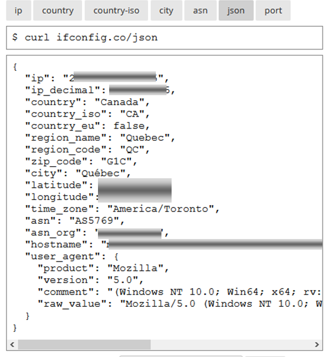

# Module 10 - Client Web avec le microcontrôleur Esp32

### Matériel

- Microcontrôleur ESP32, modèle esp32doit-devkit-v1 
- plaquette expérimentale
- afficheur LCD
- fils Dupont, mâle-femelle 

 ```Mise en garde:``` Respectez le choix des librairies à installer dans les exercices. Il existe différentes versions; celles proposées ont été consieillées.  

## Exercice 1 - Faire clignoter la DEL interne

Le but de cet exercice est de se familiariser avec les bornes du microcôntroleur et des libraires adaptées au ESP32.

Créez une nouvelle application platformIO ```AMOC_Module10_VariationMLI``` dont la fonction principale est de faire clignoter la DEL soudée sur le ESP32 à toutes les 1/2 secondes.

## Exercice 2 - Contrôle de l'intensité de DELs
 
### Brancher le matériel

Effectuez les branchements suivants sur votre plaquette expérimentale:

- reliez une DEL rouge à la borne IO25
- reliez la borne d'un bouton à la borne IO26
- Alimentez votre plaquette 
  - un fil sur une borne d'alimentation ```3,3V```
  - un fil à la mise à la terre (GND)

<details>
    <summary>Indice</summary>


</details>

### Programme

Modifiez l'application platformIO ```AMOC_Module10_VariationMLI```.

- Le programme doit fonctionner comme suit :
    - À chaque pression d'un bouton un compteur doit être imcrémenté
    - Le compteur doit être affiché et mis à jour après chaque pression
    - À chaque pression, la luminosité de la DEL rouge augmente de 20 %.
    - Lorsque la luminosité de la DEL est au maximum, la pression fait diminuer sa luminosité de 20%. Ce cycle se répète.
 
 - (optionnel) La valeur du compteur est gardée dans la mémoire EEPROM pour ajuster la luminosité au démarrage. À ce moment, la luminosité de la DEL rouge est ajustée en conséquence.
 
## Exercice 3 - Afficher l'adresse IP publique

### Objectifs

- Connecter le client Web ESP32 à intenet

- Collecter des données d'un site web en format JSON.

### Matériel
- Microcontrôleur ESP32, modèle esp32doit-devkit-v1 
- Votre afficheur LCD, modèle 1602A
- Fils de branchement

### Brancher le matériel

- branchement des bornes I2c entre ESP32 et le LCD.

#### Étape 1 - Connexion internet 

- Créez le projet Platformio ```AMOC_Module10_Client_Web```
- Le programme doit fonctionner comme suit :
    - À l'aide de la  méthode Wifi.begin de la librairie Wifi.h, établir une connexion Wifi sur votre ESP32 et votre routeur domestique.
    - Ajouter une boucle pour 30 tentatives.  En cas d'échec, le programme se termine avec un message d'erreur.
  
#### Étape 2 - Obtenir l'adresse IP publique 
- Le programme se poursuit de la façon suivante:
    - une routine est appelée pour obtenir diverses informations sur la connexion internet du ESP32 à parti du site web ```ifconfig.co```. La librairie ```HTTPClient``` sert à cette étape. 
    - Cette routine retourne une chaîne est de type String. Cette chaîne contient alors tout le texte descriptif de la connexion, sauf si une erreur s'est produite.



#### Étape 3 - Afficher les adresses IP locale et publique sur l'écran LCD 
- Le programme se poursuit de la façon suivante:
    - Le programme affiche les données JSON disponibles sur le moniteur  Série.
    - Les adresses IP locale et publique sont affichées sur l'écran LCD.

## Exercice 4 - "Fera-t-il beau, fera-t-il chaud, c'est le secret de la météo?" (optionnel)

### Objectif Utiliser la déséréalisation d'une structure JSON complexe
Le but de ce programme est d'extraire des données météo pour les afficher dans le moniteur Série.

#### Étape 1 - Obtenir des informations météo

- Créez le projet Platformio ```AMOC_Module10_Meteo_Montreal```
- Le programme doit fonctionner comme suit :
  - Basez-vous sur l'exercice précédent pour obtenir des données JSON du site web ```www.metaweather.com/api/location/3534/```.

#### Étape 2 - Extraire des données  météo

  - extraire les données quant aux températures minimale et maximale les plus récentes
  - Afficher les valeurs sur l'écran LCD (optionnel)
