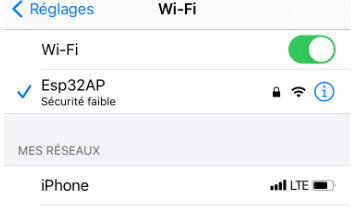
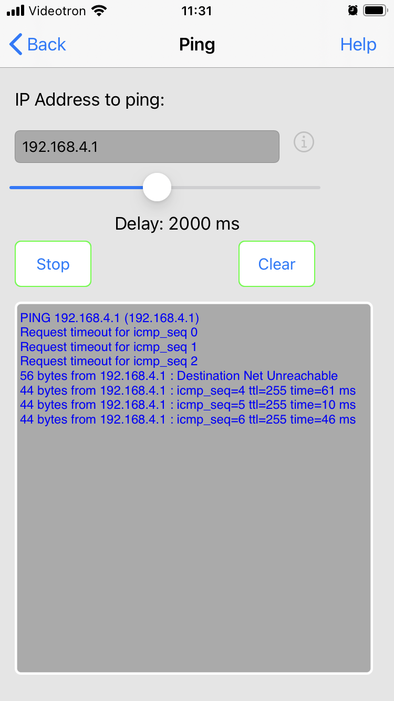
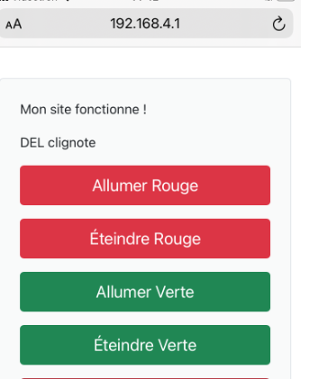

# Module 12 - ESP32 - Point D'accès

## Objectifs

Dans ces exercices, vous allez utiliser un ordinateur ou votre cellulaire pour vous connecter à votre ESP32. Votre ESP32 sera configuré comme un point d'accès sans-fil, sans lien avec internet

En premier lieu, il faudra démontrer que le ESP32 est bien configuré comme un point d'accès. C'est le classique "Hello World!" qui sera envoyé au client.

Par la suite, l'ESP32 agira comme la version Serveur Web dans une activité précédente.

Enfin, le MCU transmettra des informations lues sur un périphérique. Pour la cause, nous utiliserons un potentiomètre comme périphérique d'entrée analogique.

NOTE IMPORTANTE: si vous utilisez votre PC comme client, celui-ci ne pourra PAS se relier à votre routeur domestique par WiFi. Si votre PC n'est pas relié par RJ45, vous perdez donc l'accès à Internet ! Choisissez cette option si vous disposer d'un second ordinateur.

## Exercice 1 - Mon point d'access avec un ESP32 - 15 mins

Cet exercice a pour but de démontrer le fonctionnement d'un ESP32 en point d'accès grâce à la librairie Wifi.h.

- Créez la nouvelle application platformIO ```AMOC_Module12_HelloAC```.
- Utilisez le programme "main.cpp"  du GitHub .../AMOC_Module12_AccessPointPrepCours/src
- Configurez un fichier d'authentification config.h à votre projet. Le nom du SSID choisi est ```ESP32AP_<VotreNumeroMatricule>```. Le mot de passe sera ```12345678```

NOTE : ce mot de passe est peu sécuritaire, mais nous permet de faire des tests dans un réseau privé et isolé.

- Compilez et exécutez le programme hello.cpp.
- Mémorisez l'adresse IP de votre point d'access ```ESP32AP_<VotreNumeroMatricule>``` à partir de la console
- Comme vous l'avez configurée dans le code, le résultat de l'adresse IP sera toujours 192.168.4.1
- Sur votre cellulaire, repérez et utilisez le réseau Esp32AP.



- A l'aide du bouton (i), consultez l'adresse IP de votre client Wi-Fi.

Cette adresse DOIT se trouver sur le même réseau que l'adresse IP de votre point d'accès ```ESP32AP_<VotreNumeroMatricule>```. Sans cette condition, vous ne pouvez pas continuer.

### À observer et à répondre

- Quel protocole fournit une adresse du réseau 192.168.4.0/24 au cellulaire?
- Quelles sont les adresses possibles pour les stations se connectant à ce point d'accès ?
- Combien cela fait-il de stations potentielles ?

<details>
    <summary>Indice</summary>

La librairie ```Wifi.h``` possèdes le code d'un service DHCP. Le code est configuré pour que le réseau soit 192.168.4.0/24 avec 192.168.4.1 comme passerelle par défaut.

À partir du CIDR (/24), vous observez que le masque réseau est 255.255.255.0. Vous pouvez en déduire l'adresse réseau, ainsi que l'adresse de broadcast. Une adresse est utilisée par le point d'accès.

</details>

## Exercice 2 - Mon point d'access avec un ESP32 - 10 mins

Votre point d'access ESP32 utilise la majorité du code de vos exercices du module ```ServeurWeb```. Vous pouvez donc répliquer vos exercices précédents.

- Faire une copie de l'application platformIO ```AMOC_Module11_ServeurWeb``` dans une nouvelle application nommée ```AMOC_Module12_AP```
- Utilisez le code de l'application ```AMOC_Module12_AP```

### Étape 1 - Configurer le point d'accès ESP32

- Modifiez la connexion réseau pour une connexion au point d'accès ```ESP32AP_<VotreNumeroMatricule>```. Inspirez-vous de l'exercice 1

### Étape 2 - Accéder au point d'accès ```ESP32AP_<VotreNumeroMatricule>```

- Sur votre cellulaire, accédez au réseau ```ESP32AP_<VotreNumeroMatricule>```
- Ouvrez un navigateur web; lancez une requête web à l'adresse IP du point d'accès

<details>
    <summary>Dépannage</summary>

- Utilisez l'application "lite ping" sur votre cellulaire
- Lancez la recherche ping vers l'adresse IP du point d'accès ```ESP32AP_<VotreNumeroMatricule>```. Les requêtes doivent réussir



</details>

- Votre navigateur se trouve dans les mêmes conditions que l'exercice 3 du module_11. Vous pouvez allumer ou éteindre la DEL No 2.

## Exercice 3 - Contrôler deux DELs à distance - 15 mins

Dans cet exercice, vous allez remplacer le contrôle de la borne No 2 par le contrôle des 2 bornes GPIO 25 et GPIO 26. Si vous avez fait l'exercice optionnel du module précédent, vous pouvez réutilisez son code.

### Matériel et montage

- Plaquette d'expérimentation avec fils Dupont de branchement
- Branchez des fils dupont entre les bornes 25 et 26 de votre MCU et deux borniers de DELs de votre plaquette. Reliez le fil noir à la prise de terre (GND)
- Modifiez le code de votre application Pio pour remplacer la borne NO 2 par la borne No 25
- Compilez et exécutez le programme. (La DEL reliée au GPIO NO 25 remplace la DEL No 2)
- Modifiez le code pour pouvoir allumer et éteindre 2 DELs de votre plaquette. Votre interface html aura donc 4 boutons



<details>
    <summary>Indice</summary>

Analyser les fichiers de votre application. Repérez les endroits en référence avec la DEL No2. Adaptez le code pour 2 bornes.

</details>

## Exercice 4 - Afficher de l'information d'une borne analogique - 60 mins

Dans cet exercice, vous allez mesurer la tension d'un potentiomètre.

Si la tension se situe entre 0 V et 1,6 V, votre MCU allume la DEL verte et affiche alors ```DEL Verte allumée``` sur la page web du client connecté.

Si la tension se situe entre 1,7 V et 3,3 V (max), votre MCU allume la DEL rouge et affiche alors ```DEL Rouge allumée``` sur la page web du client connecté.

## Exercice 5 Définir le profil différent d'un point d'accès  - 10 mins (optionnel)

Dans cet exercice, vous allez modifier les configations du point d'accès ESP32.

Sans configuraton précise, la classe ```WiFi``` initie un résau sans mot de passe avec les valeurs suivantes:

- Passerelle par défaut: ```192.168.4.1```
- Masque de sous-réseau 255.255.255.0
- Sans mot de passe de connexion

Ces règles d'usage ont trois inconvénients, dans le mode pratique :

- Ces valeurs par défaut sont assez connues, donc attaquées facilement (sic)
- Sans mot de passe, les accès sont ouverts
- Si deux MCUs ESP32 sont voisins, il y aura confusion de connexion entre les clients et les points d'acces.

La méthode ```WiFi.softAPConfig()``` permet d'outrepasser ces contraintes. Elle permet de définir le SSID, l'adresse IP de la passerelle par défaut, le masque de sous-réseau et d'autres paramètres de démarrage du point d'accès

Votre tâche, si vous acceptez de la prendre, consiste à définir le réseau 10.10.1.1/24 avec le SSIP ```Esp32MissionImpossible``` et le mot de passe ```Sijedevaisvousdireoujallaisceneseraientplusdesvacances.```
