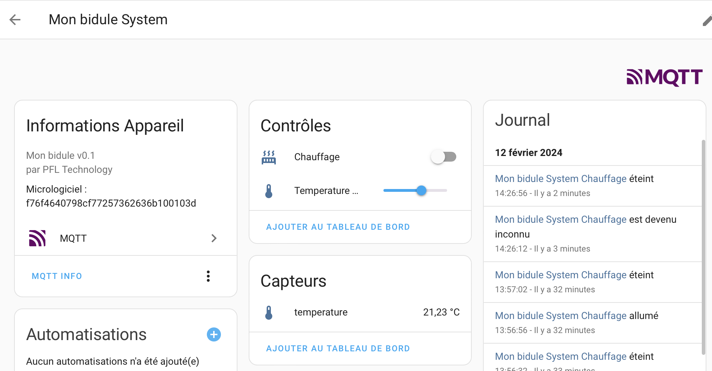
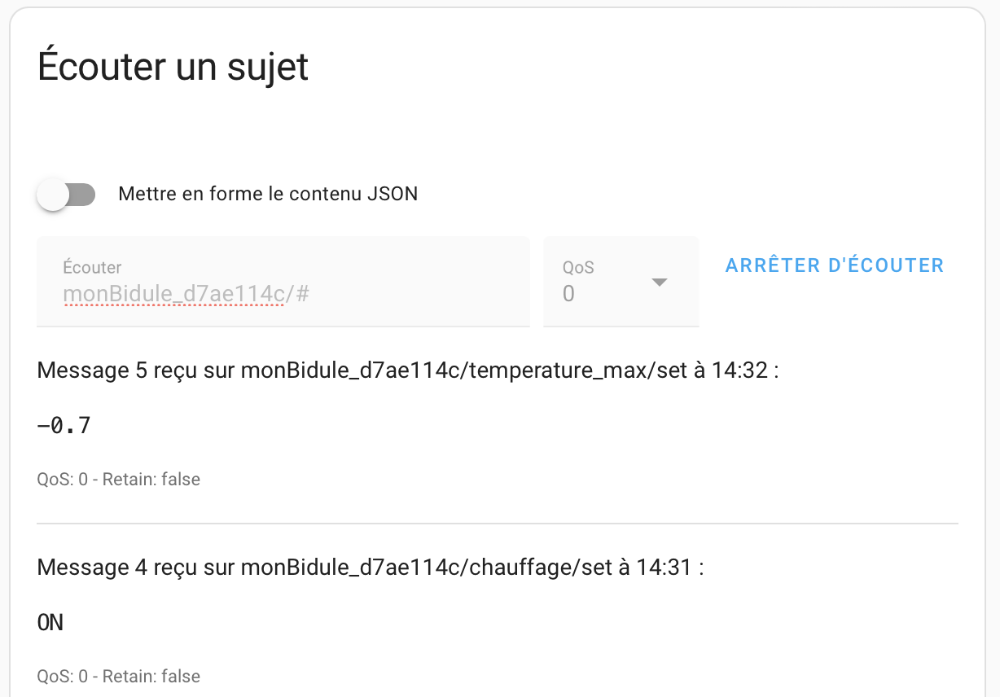
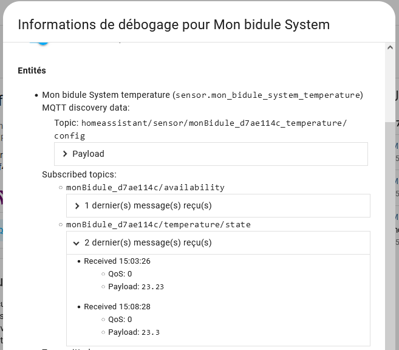
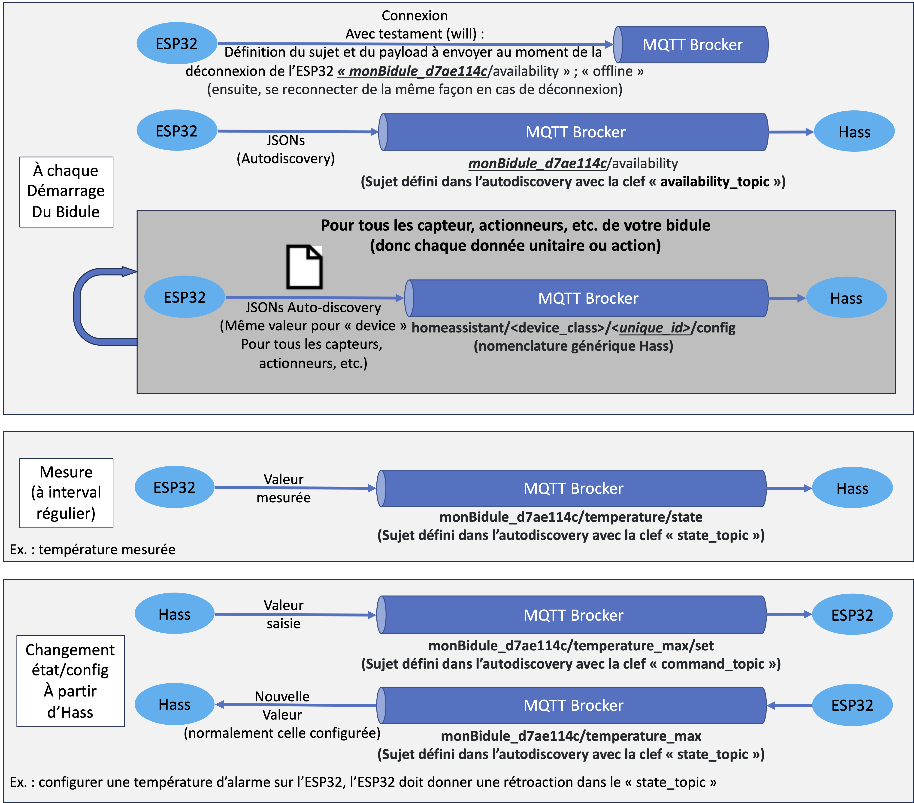

# Intégration à Home Assistant (Hass) avec MQTT

MQTT est un protocole de messagerie qui permet de transmettre des messages entre des objets connectés. Il est utilisé dans le cadre de l'Internet des objets (IoT) pour transmettre des données entre des capteurs, des actionneurs et des systèmes de contrôle, etc. Il va permettre de transmettre des données de manière asynchrone, c'est-à-dire que les messages sont envoyés sans que le destinataire ne soit prêt à les recevoir. Cela permet de réduire la consommation d'énergie des objets connectés. Les messages doivent être petits et faciles à analyser pour réduire la consommation de bande passante et d'énergie.

## Prérequis

- Avoir réalisé le [Module 13](https://github.com/PiFou86/420-W48-SF/blob/main/Module13_ESP32_WiFiManager_MQTT/Module13_ESP32_WiFiManager_MQTT_Exercices.md)
- [Avoir installé Home Assistant sur une machine virtuelle](https://www.home-assistant.io/installation/windows)
- **Ordinateur connecté au réseau filaire**
- [Avoir installé le complément Mosquitto MQTT](https://www.home-assistant.io/integrations/mqtt)
- Avoir créé un utilisateur MQTT dans Home Assistant qui va être propre à votre objet connecté
- Avoir un projet PlatformIO vierge configuré pour l'ESP32
- Y installer la librairie [PubSubClient](https://pubsubclient.knolleary.net) (Voir [Module 13](https://github.com/PiFou86/420-W48-SF/blob/main/Module13_ESP32_WiFiManager_MQTT/Module13_ESP32_WiFiManager_MQTT_Exercices.md))

## Exemple utilisé pour la suite

Dans la suite nous allons nous baser sur un appareil qui a un (1) capteur et deux (2) contrôles (les contrôles ne sont pas obligatoires dans votre TP !) :

- un capteur de température (ESP -> Hass)
- une valeur maximum de température (set : Hass -> ESP)
- un bouton on/off pour allumer / éteindre un chauffage (set: Hass -> ESP)

Pour définir cette configuration, on va devoir envoyer trois (3) messages dans MQTT, un par entité.

## Format des messages de découverte (auto-discovery) pour Home Assistant

Home assistant utilise un format spécifique pour les messages de découverte. Ce format est un message JSON qui contient principalement les informations suivantes (pour plus de détails, voir [la documentation de Home Assistant](https://www.home-assistant.io/docs/mqtt/discovery/), section "Configuration of MQTT components via MQTT discovery") :

- `name` : Nom de l'entité (Affiché dans l'interface de Home Assistant)
- `unique_id` : Identifiant unique de l'entité (Doit être unique dans Home Assistant)
- `state_topic` : Sujet (topic) où l'entité publie ses valeurs
- `command_topic` : Sujet (topic) où l'entité reçoit des commandes (S'il y a lieu)
- `device` : Informations sur l'appareil (voir plus bas)
- `availability_topic` : Sujet (topic) où l'objet publie son état de disponibilité (le même pour toutes les entités de l'appareil dans ce cours)
- `device_class` : Classe de l'entité (optionnel). **Attention, les classes sont spécifiques à chaque type d'entité. Si Hass ne connait pas la classe, il considère cela comme une erreur de configuration**. Il n'y a malheureusement pas de liste officielle des classes, mais vous pouvez rechercher le mot clef "device_class" dans la documentation.

Il existe d'autres champs obligatoires ou optionnels dépendamment du type d'entité. Se référer à la documentation de chaque type d'entité pour plus de détails.

Les informations de l'appareil (`device`) sont les suivantes :

- `identifiers` : Identifiant unique de l'appareil (Doit être unique dans Home Assistant)
- `name` : Nom de l'appareil (Affiché dans l'interface de Home Assistant)
- `model` : Modèle de l'appareil (Affiché dans l'interface de Home Assistant)
- `manufacturer` : Fabricant de l'appareil (Affiché dans l'interface de Home Assistant)
- `sw_version` : Version du logiciel de l'appareil (Affiché dans l'interface de Home Assistant)

**Attention : en cas d'erreur dans le message de découverte, Home Assistant ne va pas vous avertir et va ignorer le message. Il est donc important de vérifier que les entités sont bien créées dans l'interface de Home Assistant.**

Plus loin dans le texte, vous trouverez un outil pour ce dépannage.

## Exemple de message de découverte pour le capteur de température

Le message suivant déclare une entité `e` de type capteur de température :

- Sujet (topic) où l'appareil publie son état de disponibilité : `monBidule_d7ae114c/availability`
- L'appareil auquel il est attaché (avec son détail) :
  - Identifiant unique de l'appareil : `d7ae114c`
  - Nom de l'appareil : `Mon bidule System`
  - Modèle de l'appareil : `Mon bidule v0.1`
  - Fabricant de l'appareil : `PFL Technology`
  - Version du logiciel de l'appareil : `f76f4640798cf77257362636b100103d`
- Le type de l'entité : `temperature` (capteur de température : valeur normalisée par Home Assistant)
- Identifiant unique de l'entité : `monBidule_d7ae114c_temperature`
- Nom de l'entité : `temperature`
- L'unité de mesure de l'entité : `°C` (Pensez que certains pays n'utilisent pas le système international)
- Sujet (topic) où l'entité publie ses valeurs : `monBidule_d7ae114c/temperature/state`
- La plateforme utilisée pour l'entité : `mqtt`

```json
{
  "availability_topic": "monBidule_d7ae114c/availability",
  "device": {
    "identifiers": "d7ae114c",
    "manufacturer": "PFL Technology",
    "model": "Mon bidule v0.1",
    "name": "Mon bidule System",
    "sw_version": "f76f4640798cf77257362636b100103d"
  },
  "device_class": "temperature",
  "unique_id": "monBidule_d7ae114c_temperature",
  "name": "temperature",
  "unit_of_measurement": "°C",
  "state_topic": "monBidule_d7ae114c/temperature/state",
  "platform": "mqtt"
}
```

**Ne vous lancez pas dans l'utilisation de `value_template` ou `json_attributes_template` sans avoir une très très bonne raison.**

## Envoi des messages de découverte

Les messages de découverte doivent être envoyés dans le sujet (topic) `homeassistant/<device_class>/<unique_id>/config` (Dans l'exemple précédent `homeassistant/sensor/monBidule_d7ae114c_temperature/config`). Il est important de respecter ce format pour que Home Assistant puisse les traiter correctement.

## Comprendre la découverte automatique avec l'exemple précédent avant de créer vos messages

Nous allons ici reprendre l'exemple du capteur de température. Lorsque le message de découverte est envoyé, Home Assistant va créer automatiquement une entité avec les informations fournies dans le message. Vous pourrez retrouver cette entité dans l'interface de Home Assistant dans `Paramètres > Appareils et services > MQTT`. Il y aura écrit "1 appareil". En cliquant dessus, vous pourrez voir les entités créées automatiquement. Le bouton `CONFIGURER` permet d'ajouter des entités, au nombre de trois dans l'interface web. Vous vous assurez de la syntaxe en utilisant l'interface web.

Pour accélérer le processus de tests, nous allons simuler l'envoi de messages de découverte. Pour ce faire, nous allons utiliser un client MQTT qui permet d'envoyer des messages. Vous pouvez utiliser le client MQTT intégré à Home Assistant (`Paramètres > Appareils et services > MQTT > Configurer`) ou un client MQTT externe comme [MQTT Explorer](https://mqtt-explorer.com).

La section suivante présente les trois (3) messages de découverte pour notre exemple. Elle est suivie par les étapes pour les envoyer et de simuler l'état de l'appareil et des entités.

### Messages de découverte

Les trois (3) messages de découverte pour notre exemple sont données ci-dessous. Ils déclarent respectivement :

1. Un capteur de température
2. Un contrôle de valeur numérique (Température maximum)
3. Un bouton on/off (Allumer / éteindre un chauffage)

#### Message de déclaration du capteur de température

Sujet (topic) :

```json
homeassistant/sensor/monBidule_d7ae114c_temperature/config
```

Charge utile (payload) :

```json
{
  "availability_topic": "monBidule_d7ae114c/availability",
  "device": {
    "identifiers": "d7ae114c",
    "manufacturer": "PFL Technology",
    "model": "Mon bidule v0.1",
    "name": "Mon bidule System",
    "sw_version": "f76f4640798cf77257362636b100103d"
  },
  "device_class": "temperature",
  "unique_id": "monBidule_d7ae114c_temperature",
  "name": "temperature",
  "unit_of_measurement": "°C",
  "state_topic": "monBidule_d7ae114c/temperature/state",
   "platform": "mqtt"
}
```

#### Message de déclaration du contrôle de valeur numérique (Température maximum)

Sujet (topic) :

```json
homeassistant/number/monBidule_d7ae114c_temperature_max/config
```

Charge utile (payload) :

```json
{
  "availability_topic": "monBidule_d7ae114c/availability",
  "device": {
    "identifiers": "d7ae114c",
    "manufacturer": "PFL Technology",
    "model": "Mon bidule v0.1",
    "name": "Mon bidule System",
    "sw_version": "f76f4640798cf77257362636b100103d"
  },
  "device_class": "temperature",
  "unique_id": "monBidule_d7ae114c_temperaturemax",
  "name": "Temperature max",
  "unit_of_measurement": "°C",
  "min" : -20,
  "max" : 20,
  "mode" : "slider",
  "command_topic": "monBidule_d7ae114c/temperature_max/set",
  "state_topic": "monBidule_d7ae114c/temperature_max",
  "step": 0.1,
  "platform": "mqtt"
}
```

#### Message de déclaration du bouton on/off (Allumer / éteindre un chauffage)

Sujet (topic) :

```json
homeassistant/switch/monBidule_d7ae114c_chauffage/config
```

Charge utile (payload) :

```json
{
  "availability_topic": "monBidule_d7ae114c/availability",
  "device": {
    "identifiers": "d7ae114c",
    "manufacturer": "PFL Technology",
    "model": "Mon bidule v0.1",
    "name": "Mon bidule System",
    "sw_version": "f76f4640798cf77257362636b100103d"
  },
  "device_class": "switch",
  "unique_id": "monBidule_d7ae114c_chauffage",
  "name": "Chauffage",
  "icon": "mdi:radiator",
  "command_topic": "monBidule_d7ae114c/chauffage/set",
  "state_topic": "monBidule_d7ae114c/chauffage",
  "platform": "mqtt"
}
```

### Simulation

Pour simuler l'envoi des messages de découverte, nous allons utiliser un client MQTT qui permet d'envoyer des messages. Vous pouvez utiliser le client MQTT intégré à Home Assistant (`Paramètres > Appareils et services > MQTT > Configurer`) ou un client MQTT externe comme [MQTT Explorer](https://mqtt-explorer.com).

1. Connectez-vous à votre serveur MQTT avec votre client
2. Écoutez le sujet (topic) `homeassistant/#` pour vérifier que le message est bien reçu dans les étapes subséquentes
3. Envoyez les trois (3) messages de découverte dans les sujets (topics) respectifs
4. Validez si les messages sont bien reçus dans votre client MQTT et validez que les appareils et les entités sont bien créés dans Home Assistant. Si ce n'est pas le cas, vérifiez que les messages sont bien formatés et que les sujets (topics) sont bien respectés et recommencez à l'étape 3.
5. Écoutez le sujet (topic) `monBidule_d7ae114c/#` pour vérifier que les messages sont bien reçus dans les étapes subséquentes
6. Pour simuler l'état de l'appareil et des entités, envoyez des messages dans les sujets (topics) `monBidule_d7ae114c/availability`, `monBidule_d7ae114c/temperature/state`, `monBidule_d7ae114c/temperature_max` et `monBidule_d7ae114c/chauffage` pour simuler l'état de l'appareil et des entités. Vous pouvez aussi utiliser le client MQTT intégré à Home Assistant (`Paramètres > Appareils et services > MQTT > Configurer`) pour envoyer des messages :
   1. `monBidule_d7ae114c/availability` : `online` pour indiquer que l'appareil est disponible
   2. `monBidule_d7ae114c/temperature/state` : `23.23` pour simuler une température de 23.3°C
   3. `monBidule_d7ae114c/temperature_max` : `4.23` pour simuler une température maximale de 4.23°C
   4. `monBidule_d7ae114c/chauffage` : `ON` pour simuler un chauffage allumé

 Dans l'affichage suivant, vous pouvez voir le capteur et deux (2) contrôles.



7. Modifiez les deux (2) contrôles et validez que les valeurs sont bien envoyées à l'appareil en observant les messages reçus dans votre client MQTT.



8. Vérifiez les informations détaillées sur les entités de `Mon bidule System` en cliquant sur MQTT INFO

Si une entité est absente, ceci indique que le format du message est incompris!



### Vue générale des entités

Le tableau de bord `Aperçu` offre une vue générale des entités. Il est disponible à partir de la barre latérale.

Cliquez sur AJOUTER AU TABLEAU DE BORD.

## Création de vos messages de découverte

Pour créer vos messages de découverte, **il est vivement conseillé** d'utiliser un client MQTT qui permet d'envoyer des messages. Vous pouvez utiliser le client MQTT intégré à Home Assistant (`Paramètres > Appareils et services > MQTT > Configurer`) ou un client MQTT externe comme [MQTT Explorer](https://mqtt-explorer.com).

Étapes pour chaque entité `e` :

1. Préparez votre premier message de découverte dans Visual Studio Code (ou un autre éditeur de texte)
2. Connectez-vous à votre serveur MQTT avec votre client
3. Écoutez le sujet (topic) `homeassistant/#` pour vérifier que le message est bien reçu dans les étapes subséquentes
4. Envoyez un nouveau message dans le sujet (topic) `homeassistant/<device_class>/<unique_id>/config` (Dans l'exemple précédent `homeassistant/sensor/monBidule_d7ae114c_temperature/config`)
5. Validez si le message est bien reçu dans votre client MQTT et validez que l'appareil et l'enité sont bien créés dans Home Assistant. Si ce n'est pas le cas, vérifiez que le message est bien formaté et que le sujet (topic) est bien respecté et recommencez à l'étape 4.
6. Recommencez à l'étape 1 pour l'enité suivante. Notez que la section `device` est la même pour toutes les entités de l'appareil.

7. Pratiquez! Ajoutez l'entité  `humidity`, de type `slider` , avec l'icône `mdi:air-humidifier` à votre appareil `Mon bidule System`

## Notion de testaments (Will)

Lors d'un connexion à MQTT, vous pouvez spécifier un testament. Ce testament consiste à envoyer un message dans un sujet (topic) au moment de la déconnexion. Ce mécanisme peut être utilisé afin de savoir si votre périphérique est disponible (connecté). En résumé, une fois la connexion configurée avec le testament, vous envoyez un message indiquant que le périphérique est disponible (même topic que le testament). À la déconnexion, MQTT va envoyer le message configuré dans le testament pour indiquer l'indisponibilité du périphérique.

Généralement, le sujet (topic) est spécifique à votre périphérique. Dans le cours, nous prendrons l'identifiant de votre périphérique pour le sujet suivi de `/availability`. Exemple : `monBidule_d7ae114c/availability`.

Voici un exemple de code de connexion (le this->m_client est un objet de type PubSubClient et la méthode `setServer` a déjà été appelée) :

```cpp
if (this->m_client->connect(Configuration.getClientId().c_str(),
                            Configuration.getMqttUser().c_str(),
                            Configuration.getMqttPassword().c_str(),
                            Configuration.getMqttWillTopic().c_str(), 0,
                            true, "offline")) {
  // Une fois connecté, le périphérique se déclare comme disponible
  this->publish(Configuration.getMqttWillTopic().c_str(), "online");
  Logger.infoln(String(F("MQTT: Connected to MQTT server.")));
} else {
  Logger.errorln(String(F("MQTT: Failed to connect to MQTT server.")));
}
```

On peut résumer le fonctionnement de la connexion à MQTT avec testament comme suit :

## Flux idéal des actions à réaliser sur l'objet connecté

1. Connexion à votre réseau FILÉ (iot_lab pour le cours)
2. Connexion au serveur MQTT (Nom unique, adresse IP de votre machine virtuelle, port 1883, utilisateur et mot de passe créé dans Home Assistant pour votre objet connecté) :
   1. Il définit un sujet (topic) pour son testament (will) ainsi qu'un message (`offline`)
   2. Il envoie un message pour indiquer qu'il est disponible (`online`)


3. Pour chaque entité `e` (capteur, actionneur, etc.) :
   1. Il déclare les informations de l'entité `e` dans un message JSON qui suit un format spécifique à Home assistant dans un sujet (topic) lui aussi spécifique à Home assistant. Ce message contient la même section qui décrit votre appareil (`device` voir plus bas).
   2. Il s'abonne à un sujet (topic) pour recevoir des commandes (S'il y a lieu)


4. Il publie les valeurs des capteurs et les états des autres entités dans les sujets (topics) déclarés à l'étape 3 (`state_topic` voir plus bas)


5. S'il y a lieu, il reçoit des commandes dans les sujets (topics) déclarés à l'étape 3 (`command_topic` voir plus bas). Il met à jour l'état de l'entité en conséquence (Si nécessaire).


2. Il recommence à l'étape 4. En cas de déconnexion, il fait l'étape 2 et saute à la 4 : il n'est pas nécessaire de refaire les étapes 3.


## Schéma résumé de l'intégration

| Type de message | Sujet | Contenu | Clef autodiscovery |
| --- | --- | --- | --- |
| Disponibilité | `<identifiant_materiel>/availability` | `online` ou `offline` | `availability_topic` |
| Découverte | `homeassistant/<device_class>/<unique_id>/config` | JSON | N/A |
| Valeur | `<identifiant_materiel>/<identifiant_capteur_sans_identifiant_materiel>[/state]` | Valeur | "state_topic" |
| Commande | `<identifiant_materiel>/<identifiant_capteur>/set` | Valeur | "command_topic" |


