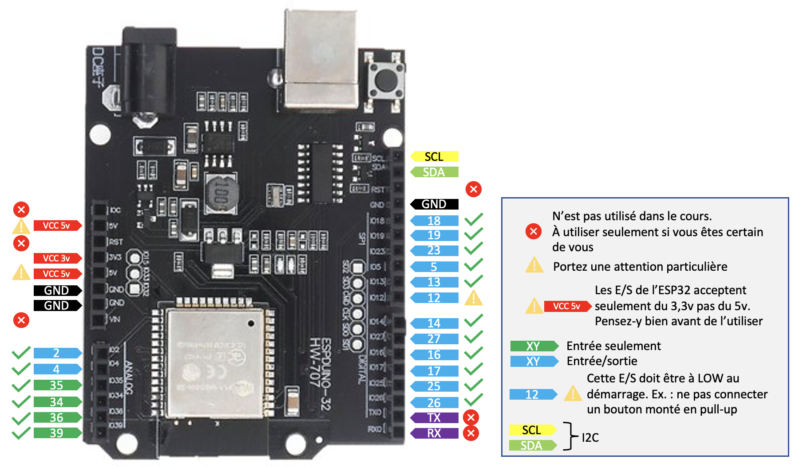

# En bref

## Dans ce dossier

### Debogage

Quelques exemples de code pour déboguer votre code en C++ sans outil supplémentaires (old school). Vous avez un exemple de classe utilitaire de journalisation dans le projet [Utilitaires de développement et démos](https://github.com/PiFou86/420-W48-SF-Utilitaires-Demo).

### EEPROM

Code exemple de test et utilisation de la mémoire EEPROM avec CRC et déplacement dans la mémoire pour économiser les cycles d'écriture.


### I2C_Explique

Explication plus avancée et détaillée de l'interface I2C.

### Test4Digits_TM16837

Code exemple de test et utilisation de l'afficheur 4 chiffres TM16837.

### TestBME280

Code exemple de test et utilisation du capteur BME280/BMP280 : attention de bien choisir les morceaux de codes actifs suivant le type de capteur (BMP vs BME).

### TestLCD

Code exemple de test et utilisation de l'afficheur LCD 16x2.

### TestOLED

Code exemple de test et utilisation de l'afficheur OLED 128x64. Ce composant n'est pas dans votre kit de démarrage.

### Autres codes exemples dans des dépôts externes

- [Utilitaires de développement et démos](https://github.com/PiFou86/420-W48-SF-Utilitaires-Demo) : projet contenant des exemples de codes faire du débogage. Au menu, classes de journalisation, console sur le port série pour réaliser des affichages sur ce qui est connecté, la configuration réseau etc.
- [Pool monitoring](https://github.com/PiFou86/pool-monitoring/) : projet personne de monitoring de piscine avec ESP32 et capteurs BME280, DS18B20, etc.

## ESP32

Voici un schéma des broches de l'ESP32 :



(Adapté de : https://randomnerdtutorials.com/esp32-pinout-reference-gpios/  à la plaquette utilisée en cours)

## Problèmes communs

### Compilation

#### Résolution de dépendances

Il est possible que Pio ne trouve pas toutes dépendances des bibliothèques. Pour forcer une recherche approfondie, vous pouvez utiliser le paramètre ```lib_ldf_mode``` avec la valeur ```deep+``` décrit dans la documentation : [lib-ldf-mode](https://docs.platformio.org/en/stable/projectconf/section_env_library.html#lib-ldf-mode).

### Réseau

#### Bridge WiFi

Certains couples "Point d'accès" et "Carte réseau WiFi" fonctionnent mal ensemble et ne permettent pas de créer un bridge fonctionnel dans votre outil de virtualisation favori. Si vous rencontrez des problèmes avec un bridge WiFi, il est conseillé d'utiliser un bridge sur une interface physique. (Référence : https://forums.virtualbox.org/viewtopic.php?t=98133).

Si votre ordinateur ne possède PAS de carte réseau filée Ethernet, consultez votre formateur.

#### Affichage de la configuration actuelle

N'hésitez pas à afficher votre configuration réseau dans la console afin de valider que vous avez bien les bonnes informations.

Si vous voulez allez plus vite, vous pouvez inclure le code de [Utilitaires de développement et démos](https://github.com/PiFou86/420-W48-SF-Utilitaires-Demo).

### Système de fichiers

SPIFFS a modifié sa façon de transiger avec les répertoires À VALIDER. Une solution est de retourner sur l'ancienne version du module ESP32 (attention que d'autres versions plus récentes ne soient pas installées).

Par exemple, pour forcer la version de la plateforme pour l'ESP32 à la version 3.5 vous pouvez ajouter le texte suivant dans votre fichier platformio.ini :

```ini
[env]
platform = espressif32@~3.5.0
```

Source : https://docs.platformio.org/en/latest/projectconf/section_env_platform.html 

### Home assistant

Depuis la version 2022.06, la déclaration des capteurs (sensors) de type mqtt a été modifiée ([2022.06 - Breaking Changes](https://www.home-assistant.io/blog/2022/06/01/release-20226/#breaking-changes)). Elle passe de :

```yaml
sensor:
  - platform: "mqtt"
    name: "My sensor"
    state_topic: "some-state-topic"
```

à

```yaml
mqtt:
  sensor:
    - name: "My sensor"
      state_topic: "some-state-topic"
```

### Consommation d'énergie

L'autonomie énergétique est importante pour les clients. Elle répond aux questions suivantes :

- Durée de charge de la pile :
Pour y arriver, il faut déterminer la consommation moyenne de votre Station Météo, (puisance (courant, tension)) par unité de temps versus la puissance disponible de la pile à pleine capacité). ceci détermine le temps d'autonomie entre 2 chargements

- Méthodes de recharge

**à chercher**

- autres sources de courant : pannaux solaires, éoliennes, etc
